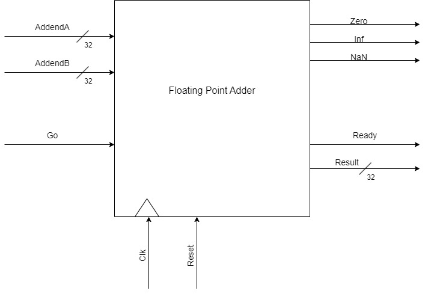
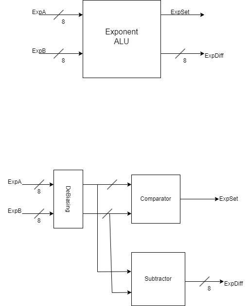
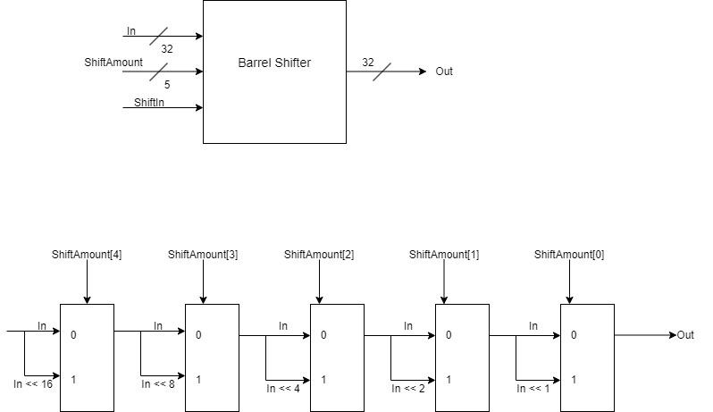

## Documentation
This directory includes all documentation surrounding the design choices, for how to run the system please refer to the master README at the root of this project.

## Block Diagram

## Floating Point Interface
For the floating point system the user is required to put their two addends on lines addendA and addendB, when the user wants to begin computation they will set
the Go bit high, in which place the Ready bit will go low. The Ready bit stays low until the computation is complete, where the system will set the Ready bit high
and the Result of the computation will be on the Result line. The computation also will provide a Zero, Inf, and NaN flags to alert the user to if the result was
zero, infinity, or not-a-number respectively. The AddendA, AddendB, and Result are all of type float, which is a packed struct representing the IEEE-754 single
precision floating point number. Because it is packed, the user can either use the 32-bit number directly, or convert to a realshort using the provided package 
interfaces. The floating point adder recieves a clock and reset for an internal control system, but the system is not designed to operate around a set calculation
period but instead relies on handshaking for the computation.

## Sub Components

# Exponent ALU
Exponent ALU

The Exponent ALU is responsible for detemring which exponent is passed forward and by what amount the system should do a right shift of the smaller exponents'
mantissa. The exponent ALU takes in two 8-bit wide exponents and returns an 8-bit difference and set bit that are fed to the FSM. First the exponent ALU needs
to de-bias the incoming exponents by subtracting 128 from them, it then will pass these to a comparison unit that sees if A >= B or A < B. If the former is true
the ExpSet bit is set to 1, else it is set to 0. This set bit is also used to determine the subtraction operation where the smaller exponent is subtracted from
the larger and this returns the difference result to ExpDiff.

# Normalizer
Barrel Shifter

