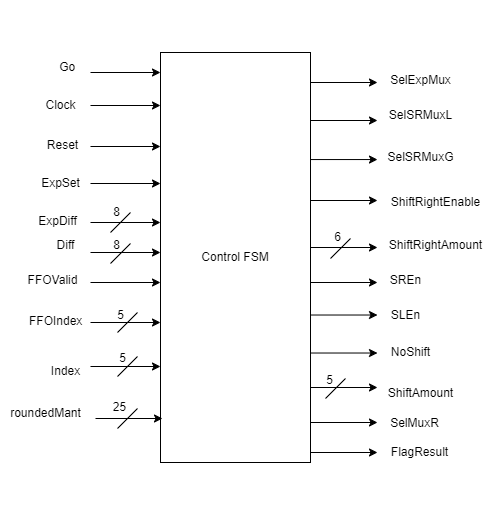

## Documentation
This directory includes all documentation surrounding the design choices, for how to run the system please refer to the master README at the root of this project.

## Block Diagram

## Floating Point Interface
For the floating point system the user is required to put their two addends on lines addendA and addendB, when the user wants to begin computation they will set
the Go bit high, in which place the Ready bit will go low. The Ready bit stays low until the computation is complete, where the system will set the Ready bit high
and the Result of the computation will be on the Result line. The computation also will provide a Zero, Inf, and NaN flags to alert the user to if the result was
zero, infinity, or not-a-number respectively. The AddendA, AddendB, and Result are all of type float, which is a packed struct representing the IEEE-754 single
precision floating point number. Because it is packed, the user can either use the 32-bit number directly, or convert to a realshort using the provided package 
interfaces. The floating point adder recieves a clock and reset for an internal control system, but the system is not designed to operate around a set calculation
period but instead relies on handshaking for the computation.

## Sub Components

# Exponent ALU
Exponent ALU

The Exponent ALU is responsible for detemring which exponent is passed forward and by what amount the system should do a right shift of the smaller exponents'
mantissa. The exponent ALU takes in two 8-bit wide exponents and returns an 8-bit difference and set bit that are fed to the FSM. First the exponent ALU needs
to de-bias the incoming exponents by subtracting 128 from them, it then will pass these to a comparison unit that sees if A >= B or A < B. If the former is true
the ExpSet bit is set to 1, else it is set to 0. This set bit is also used to determine the subtraction operation where the smaller exponent is subtracted from
the larger and this returns the difference result to ExpDiff.

# Big ALU
Big ALU

The Big ALU is responsible for adding the 2-mantissas together using 2's compliment. Because the IEEE-754 standard is in signed magnitude, and we have the implied
1 for the 1.M, we need to pass the sign down to select if we need to 2's compliment the numbers before adding, this is accomplished with the sign bit and 2:1 Mux.
We also need to append the signed bit to the front of the values so as to add the signed information back in, to give the number a true 2's compliment value. Once
this is accomplished we pass the values into an adder and return the result along with the ccc, ccz, ccv, and ccn flags to be consumed by the normalizer circuit.

# Normalizer
### Barrel Shifter

### Find First One

### Normalizer

The normalizers circuitry (we decided to pull the find first one out but is a part of its function) purpose is to take in the mantissa and shift it to the appropriate
point such that we get 1.M format. This may involve a single right shift or a left shifter. The left shift was implemented using the barrel shifter provided in class
where the right shifter is hard coded as it is only ever one shift. The find first one's circuities job is to find the first occurrance of a one and then return the
index to that one location, allowing us to determine by what amount the mantissa needs shifter to create the 1.M value. The exponent normalization is also accomplished
by this determined shift amount based on if we shift left or right then merely do a add or subtract operation.

# Rounding Hardware
TODO: add rounding hardware diagram

# Controll System

The FSM controls the components in the data path during the design flow. The functions of the FSM are as follows:

1. Based on the Exponent Difference, the FSM either enables or disables the Right Shift register. Simultaneously the FSM also enables the selector for the Exponent Mux.
This step ensures that the smaller Addend Mantissa is right shifted and its Exponent is incremented by exponent Differences.

2. The FSM uses FFOValid and FFOIndex to initiate normalization. When carry is generated during the addition, the Sum is right shifted once. If the MSB-1 bit of the Sum
is '1', the Sum is left shifted once. Otherwise, shift operation is not performed on the Sum.

3. During rounding, the FSM checks if a carry is generated. When a carry is generated, the FSM performs normalization by shifting the Result to the right as well as
incrementing the exponent.

4. After rounding, the FSM sets the Ready signal until the reception of the next Go signal.

# Testing Strategy
For the testing our strategy we used directed and constrained randomized testing. For the directed testing we wanted to test the following cases:

--- -0 added to +0

--- -0 added to a float

--- +0 added to a float

--- The two largest numbers for IEEE-754 added together

--- The two smallest numbers fo IEEE-754 added together

--- Three regular numbers added together

---- one with opposite signs and two with matching signs

For the randomized testing we used the floating point model we made in class but also added a constraint that produces only normalized numbers. We run through 2^32 cases
of this randomization constraint where we are feeding normalized numbers into our adder. We then randomize with the constraint of only denormalized numbers to pass into 
our module to verify that we can handle denorms (without doing the addition) gracefully. We also do this 2^32 times to make sure we don't encounter any edge cases. Our 
final randomization test disables all constraints and we generate 2^32 random numbers in the hopes to generate some NaN and INF numbers to verify our approach.

We want to use coverage to verify that we see rounding, a denormalized result, and one of an INF or NaN in our results output (ideally both). The hope is by iterating over 2^32
cases we increaase our chances of hitting all possibilities for the adder and any possible edge cases.

## Submodule Testing
We used the V approach to testing that was discussed in class. Each sub-module that we designed we also created tests for to verify that our approach was correct. This
allowed us to have extreme confidence that bugs at the sub-module level would be design based and spec based and not logical errors. Each test can be ran individually from
the Makefile using the `make <module>` command and DEBUG can be set to true. This approach was chosen as it allowed multiple people to work on sub-components without having
to have an immediate knowledge of the final integration of the system. Tests followed exhaustive testing standards where applicable, and assertions were used for the FSM.
